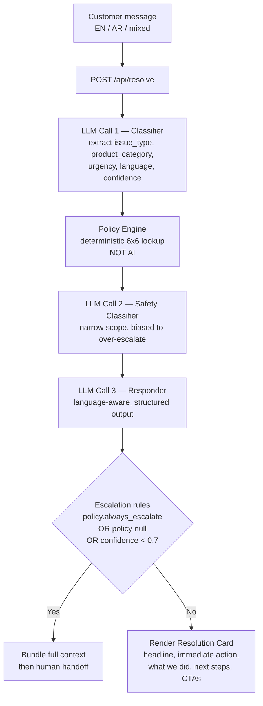

# Smart Returns Resolver

> A bilingual AI triage layer for e-commerce customer support. Reads a mom's complaint in English, Arabic, or code-switched mix — classifies it, applies a deterministic policy matrix, screens for safety risks, and either resolves the case in under 30 seconds or hands it off to a human with full context bundled.

[](https://nextjs.org/)
[](https://react.dev/)
[](https://www.typescriptlang.org/)
[](https://zod.dev/)
[](https://platform.openai.com/)
[](EVALS.md)
[](https://mumzworld-resolver.vercel.app/)
[](#license)

---

## Links

| | |
|---|---|
| 🚀 **Live demo** | [mumzworld-resolver.vercel.app](https://mumzworld-resolver.vercel.app/) |
| 🎬 **3-minute walkthrough** | [Loom video](https://www.loom.com/share/b016f4c6c0194f11bcf12711d1ced2fd) |
| 💻 **Source** | [github.com/chinmoypaul8897/mumzworld-resolver](https://github.com/chinmoypaul8897/mumzworld-resolver) |
| 📊 **Evaluation report** | [`EVALS.md`](EVALS.md) — 88.5% (69/78 dimensions) |

---

## The Problem

When something goes wrong with an order — a delayed formula delivery at 11pm, a damaged car seat, a wrong size onesie — the customer's path to resolution is usually:

1. Open the app, find Help.
2. Get gated by a chatbot demanding name, language, email, category, and order ID **before** typing the actual issue.
3. Wait for a human who, when they arrive, asks for the order ID again — even though the chatbot already collected it.
4. Re-explain the entire situation. Sometimes in a different language than the one the app is set to.
5. Receive "we'll get back to you within 24 hours."

By that point, baby has run out of formula, the parent has driven to a 24-hour pharmacy, and a 1-star review is being drafted at 2am.

The chatbot doesn't *read* the message — it *sorts* it. It doesn't extract context — it gates for it. It doesn't understand urgency — it queues by category. The result: humans always start cold, easy cases burn agent time, and urgent cases wait their turn behind them.

## The Solution

Smart Returns Resolver is the **missing triage layer** between the chatbot and the human team. One textarea (or voice input). The system:

1. **Reads** the message in whatever language and register the customer wrote in.
2. **Classifies** it — issue type, product category, urgency tier, emotional state, confidence.
3. **Looks up** the entitlement in a deterministic 6×6 policy matrix (no LLM-decided refunds — those are legal exposure).
4. **Screens** independently for safety risks (warm formula, damaged car seat, chemical contamination near baby food).
5. **Drafts** a structured response — headline, immediate action, what we did, what happens next, talk-to-a-human CTA.
6. **Escalates** intelligently: hard rules from the policy table override LLM judgment; low-confidence cases route to humans with the full conversation context bundled.

Time to clarity drops from ~24 hours to under 30 seconds for ~80% of cases. Humans stop starting cold. The customer never re-explains.

---

## Key Features

- **Bilingual NLU with code-switching detection.** English, Arabic (MSA + dialects), and real mixed-language input — not just a language toggle, but actual register-matching in the response.
- **Deterministic policy engine.** Entitlements (refund, replacement, store credit, alternative offered, escalate, honor original price) are looked up from a hand-authored 6×6 matrix in [`lib/data/policy-table.ts`](lib/data/policy-table.ts). The LLM never invents what the customer is owed.
- **Independent safety classifier.** A second, narrow-scoped LLM call biased toward over-escalation. Triggers on temperature/contamination on consumables, any damage on safety-critical items, and out-of-scope medical questions. Never diagnoses, never reassures.
- **Schema-validated everywhere.** Every LLM output is parsed against a [Zod schema](lib/schemas/). Failures are explicit, not silent. A custom JSON quote-repair pass in [`lib/llm/harness.ts`](lib/llm/harness.ts) handles malformed model output.
- **RTL UI + voice input.** The frontend flips to right-to-left when the response is Arabic. Voice input via the browser's Web Speech API for one-handed use.
- **15-case eval suite with LLM-as-judge.** Structural rubric across 12 dimensions per case, plus an Arabic-language soft-signal judge for tone and register. Current score: **88.5%** ([`EVALS.md`](EVALS.md)).
- **Graceful escalation.** Whenever the system is uncertain, it hands off to a human with the full classification, policy decision, and conversation context bundled — not "click here to start over."

---

## Tech Stack

| Layer | Choice | Why |
|---|---|---|
| Framework | Next.js 16 (App Router) + React 19 | API route + UI in one process |
| Language | TypeScript 5 | Type-safe schema flow end-to-end |
| Validation | Zod 4 | Runtime parse of every LLM output |
| Styling | Tailwind CSS 4 | Hand-written utility classes, mom-friendly palette |
| AI runtime | OpenAI `gpt-4o-mini` | Reliable structured-output mode, low latency |
| AI eval | OpenAI `gpt-4o-mini` (LLM-as-judge) | Soft-signal scoring of Arabic tone/register |
| Harness | OpenRouter (free tier) | Multi-model bake-off during prompt iteration |
| Voice input | Web Speech API | Browser-native, no external dependency |
| Deployment | Vercel | Zero-config for Next.js |

---

## Architecture



The pipeline is orchestrated in [`lib/engine/orchestrator.ts`](lib/engine/orchestrator.ts) and exposed at [`app/api/resolve/route.ts`](app/api/resolve/route.ts). Each LLM call has its own Zod schema, its own retry policy, and its own latency instrumentation. The classifier's `needs_human` hint is **not** authoritative — the policy table is. This is intentional: the LLM extracts; the deterministic layer decides.

### Why two LLM calls instead of one big prompt

Splitting *understand* from *respond* lets each layer be evaluated independently. The classifier is graded on classification correctness; the responder is graded on tone, structure, and grounding. The eval suite scores them on different dimensions. A monolithic prompt that does both would be cheaper to run but impossible to debug when it goes wrong.

### Why the safety classifier is a third call

Safety routing is the legally-riskiest part of the system. False positives cost a CS rep five minutes; false negatives cost a baby's safety. Running it as a separate call — with its own narrow prompt, its own eval cases, and an explicit over-escalation bias — means safety decisions can be tuned in isolation without touching the rest of the pipeline. In practice, this caught two cases (S2: dented car seat box; S3: chemical contamination near baby food) where the main classifier missed the urgency.

---

## Getting Started

### Prerequisites

- **Node.js 20+** (LTS recommended)
- **npm** (or pnpm/yarn — examples below use npm)
- An **OpenAI API key** (`gpt-4o-mini` is the runtime model; ~$0.50 covers the full eval suite)
- *(Optional)* An **OpenRouter API key** if you want to re-run the multi-model harness in [`lib/llm/runs/`](lib/llm/)

### Environment variables

Copy [`.env.example`](.env.example) to `.env.local` and fill in:

| Variable | Required | Purpose | Example |
|---|---|---|---|
| `OPENAI_API_KEY` | Yes | Runtime LLM — classifier, safety, responder | `sk-...` |
| `OPENROUTER_API_KEY` | Optional | Multi-model harness for prompt bake-offs | `sk-or-...` |

> Never commit `.env.local`. It is gitignored by default.

### Installation

```bash
# Clone
git clone https://github.com/chinmoypaul8897/mumzworld-resolver.git
cd mumzworld-resolver

# Install
npm install

# Configure secrets
cp .env.example .env.local
# Edit .env.local and add your OPENAI_API_KEY
```

### Running locally

```bash
# Dev server with hot reload
npm run dev

# Open http://localhost:3000
```

### Production build

```bash
npm run build
npm run start
```

### Running the evaluation suite

```bash
# Runs all 15 cases against the live orchestrator.
# Writes results to evals/results/eval-<timestamp>.json
npx tsx evals/run-evals.ts

# Soft-signal Arabic tone judge (uses gpt-4o-mini)
npx tsx evals/arabic-judge.ts
```

---

## Usage

### API

The resolver is a single POST endpoint:

```
POST /api/resolve
Content-Type: application/json

{
  "message": "my formula was supposed to come yesterday, baby has 2 feeds left, please i'm panicking",
  "order_id": "M44521"
}
```

#### Sample request

```bash
curl -X POST http://localhost:3000/api/resolve \
  -H "Content-Type: application/json" \
  -d '{
    "message": "my formula was supposed to come yesterday, baby has 2 feeds left, please i am panicking",
    "order_id": "M44521"
  }'
```

#### Sample response

```json
{
  "headline": "We can get you formula tonight.",
  "immediate_action": "Show this code at the nearest 24-hour pharmacy for a free equivalent tin: PHARMA-MZ-7741.",
  "what_we_did": [
    {
      "label": "Pharmacy alternative authorized",
      "detail": "Same-day pickup at your nearest partner pharmacy, free of charge."
    },
    {
      "label": "Priority shipping refunded",
      "detail": "AED 28 returning to your original payment method within 3 business days."
    }
  ],
  "what_happens_next": "Your original order arrives tomorrow at 10am. Tap below if you'd prefer to redirect it for return.",
  "talk_to_human_cta": {
    "label": "Talk to a person",
    "context_bundle": {
      "order_id": "M44521",
      "issue_type": "delivery_delay",
      "urgency": "safety_critical",
      "language": "en"
    }
  },
  "safety_warning": null,
  "language": "en",
  "meta": {
    "classification_confidence": 0.94,
    "used_human_escalation": false,
    "response_generation_ms": 4831
  }
}
```

### Orchestrator (programmatic use)

The engine is also importable directly — useful for evals, batch processing, or embedding in another service:

```ts
import { resolve } from "@/lib/engine/orchestrator";

const result = await resolve({
  message: "the car seat box has a dent in it, the seat looks fine though",
  order_id: "M44698",
});

console.log(result.safety_warning?.severity); // "critical"
console.log(result.meta.used_human_escalation); // true
```

---

## Project Structure

```
mumzworld-resolver/
├── app/                          # Next.js App Router
│   ├── api/resolve/route.ts      # POST /api/resolve — calls the orchestrator
│   ├── layout.tsx                # Root layout, fonts, RTL handling
│   └── page.tsx                  # Customer-facing UI (textarea, voice, result card)
│
├── lib/
│   ├── engine/                   # The core pipeline
│   │   ├── orchestrator.ts       # 3-LLM chain + policy lookup + escalation logic
│   │   ├── classifier.ts         # LLM call 1 — extract & classify
│   │   ├── policy.ts             # Deterministic policy lookup
│   │   ├── safety.ts             # LLM call 2 — safety screening
│   │   └── responder.ts          # LLM call 3 — language-aware response
│   │
│   ├── llm/
│   │   ├── openai.ts             # OpenAI client w/ rate-limit handling
│   │   ├── openrouter.ts         # OpenRouter client (harness only)
│   │   ├── harness.ts            # Multi-model test harness w/ JSON repair pass
│   │   └── runs/                 # Saved bake-off results (committed for traceability)
│   │
│   ├── schemas/                  # Zod schemas — every LLM output is validated
│   │   ├── classification.ts     # Issue type, category, urgency, confidence, language
│   │   ├── policy.ts             # Entitlement cell shape
│   │   ├── safety.ts             # Safety alert + severity + disclaimer flag
│   │   ├── resolution.ts         # Split: ModelOutput vs full Resolution (see Design Decisions)
│   │   └── order.ts              # Mock order shape
│   │
│   ├── data/                     # Static data — swap for real fetchers in prod
│   │   ├── mock-orders.ts        # 15 realistic orders, all 6 categories
│   │   ├── mock-order-summary.ts # Lightweight summaries for UI dropdown
│   │   ├── policy-table.ts       # The 6x6 entitlement matrix
│   │   └── safety-rules.ts       # Reference rules for the safety classifier
│   │
│   └── prompts/                  # System messages + user-message templates
│       ├── classifier.ts         # v2 — tightened against SKU leakage & panic detection
│       ├── responder-en.ts
│       ├── responder-ar.ts       # Dialect register-matching
│       └── safety.ts             # Hard rules + over-escalation bias
│
├── evals/
│   ├── test-cases.json           # 15 cases: 5 easy + 5 adversarial + 3 safety + 2 must-refuse
│   ├── run-evals.ts              # Test runner — produces per-tier breakdown
│   ├── scorer.ts                 # Strict-mode binary rubric (12 dimensions per case)
│   ├── arabic-judge.ts           # LLM-as-judge for AR tone & register
│   └── results/                  # Run artifacts (JSON)
│
├── EVALS.md                      # Detailed evaluation report — 88.5%, failure analysis
├── .env.example
└── package.json
```

---

## Design Decisions

Three choices that shaped the system and would shape any v2.

### 1. The deterministic policy table is the actual product

Entitlements (what the customer is owed) cannot be hallucinated. Wrong entitlements equal legal exposure. So the LLM never decides — it classifies the issue, then a hand-authored 6×6 lookup table in [`lib/data/policy-table.ts`](lib/data/policy-table.ts) returns the entitlement, SLA, escalation flag, and stop-use warning. 36 cells, auditable, reviewable by a non-engineer, modifiable without a code review.

The strategic side-effect: building this AI is also a forcing function for any organization to consolidate its returns policy into a single authoritative source. That's a meta-win, not a problem.

### 2. The schema split between `ResolutionModelOutput` and `Resolution`

Early versions had the LLM emit the full `Resolution` object — including `language` and a `meta` block with timing and confidence. Models occasionally typo'd the meta field name (`"used_human_escalation{": false}` was a real failure), and asking the model to echo instrumentation invited drift.

The fix wasn't a prompt rewrite — it was an architectural cut. [`lib/schemas/resolution.ts`](lib/schemas/resolution.ts) now defines two schemas:

- `ResolutionModelOutputSchema` — what the LLM actually returns (content only)
- `ResolutionSchema` — full output, with `language` and `meta` stamped by the engine deterministically

Lesson: when a prompt has a hallucination problem on a field, *removing the field from the model's responsibility* is sometimes cleaner than tightening the prompt.

### 3. JSON quote-repair at the harness layer, not the prompt layer

During testing, some open-weight models occasionally emitted JSON with mixed quote styles (`"key':value` — opening double, closing single) while the *content* was correct. Fighting it in the prompt was a losing battle. [`lib/llm/harness.ts`](lib/llm/harness.ts) now does a strict parse first, then on failure runs a repair pass: replace stray escaped quotes and single-quote-as-string-delimiters with double quotes, parse again. Lossy for English contractions inside string values; acceptable given our schemas use enums and short labels. One fix at the harness layer benefits every prompt.

Lesson: when the model returns *correct content with formatting bugs*, the fix belongs at the parser, not the prompt.

---

## Evaluation

The full report is in [`EVALS.md`](EVALS.md). Headline numbers:

| Tier | Cases | Dimensions | Passed | Score |
|---|---:|---:|---:|---:|
| Easy | 5 | 33 | 30 | 90.9% |
| Adversarial | 5 | 20 | 16 | 80.0% |
| Safety | 3 | 18 | 16 | 88.9% |
| Must-refuse | 2 | 7 | 7 | **100%** |
| **Total** | **15** | **78** | **69** | **88.5%** |

Strict-mode binary scoring — no partial credit. Single-attempt runs (no retries inside the eval). Zero pipelines threw end-to-end; every case produced a Zod-valid `Resolution`.

The most important finding wasn't the score — it was that on the two safety cases the main classifier mis-rated urgency (S2, S3), the *independent* safety classifier still caught the issue and routed correctly. That's the architecture earning its keep.

<details>
<summary><strong>Top failure patterns and the v3 path</strong></summary>

Three of the five failed cases (E4, A2, A5) all show the same pattern: the classifier conservatively returns `product_category: "unknown"` when it's not certain, which cascades into `policy: null` and forces human escalation. This is the trade-off the classifier prompt's v1→v2 explicitly chose ("never invent facts"). It is safer than hallucinating but loses cases that should auto-resolve. v3 will address this with: *"If a product is named in the message, infer category from the product even when other signals are weak."* Estimated impact: ~94% overall.

The two safety cases (S2, S3) where the main classifier mis-rated urgency were both *caught* by the independent safety classifier — exactly the architectural insurance the second LLM call was designed to provide.

The full per-case breakdown is in [`EVALS.md`](EVALS.md).

</details>

---

## Roadmap

- [ ] **Classifier v3** — fix the `unknown`-cascade pattern surfaced by E4, A2, A5 (estimated +6pp on the eval suite)
- [ ] **Multi-issue handling** — when a complaint has two issues, classify both and bundle for human, don't drop one
- [ ] **Conversation continuity** — stateful re-opens when a replacement also fails
- [ ] **CS override dashboard** — every override becomes prompt-iteration training signal
- [ ] **Native Arabic reviewer in the loop** — replace the LLM-as-judge soft signal with ground truth
- [ ] **Real backend integration** — order system writes, warehouse coordination, refund authorization
- [ ] **Anti-abuse layer** — pattern-detection for refund-gaming
- [ ] **Marketplace 3-way routing** — for third-party brand returns that don't flow through the main warehouse

---

## Contributing

Contributions are welcome. Before opening a PR:

1. Open an issue describing the change.
2. Run `npm run lint` and the eval suite (`npx tsx evals/run-evals.ts`); the eval score should not regress.
3. If you change a prompt, commit the new bake-off output in `lib/llm/runs/` so reviewers can see the before/after.

For prompt iterations specifically, please follow the convention used in commit history: `chunk N.M: <component> v<old> -> v<new> + <one-sentence reason>`.

## License

[MIT](LICENSE) © 2026 Chinmoy Paul. See [`LICENSE`](LICENSE) for the full text.

---

<sub>Built as an exploration of how AI triage can sit between rule-based chatbots and human customer-service teams without replacing either.</sub>
